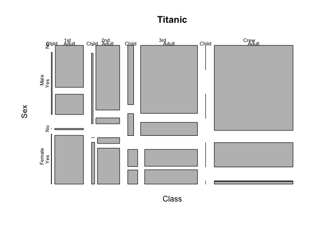

Data_pratical_1
================
simon_willemin
(24 juin, 2022)

# Goal

The goal of this report is to try to fake knowing what I’m doing, while
actually not having a **clue**

## Psychonalaysis

Anyway since I really like depths psychology :

1.  Are
2.  you
3.  subject
4.  to
5.  the
6.  Oedipal complex ?
7.  *Because I do*

# The man himself


**Now let’s get to something else**

Since I *didn’t* find any data about your oedipal complex, I had to find
something else. What else then, than some data about the Titanic, in
order to find out if Jack could’ve fit on that floating wooden door ?
Hmm ?

``` r
data("Titanic")
summary("Titanic")
```

    ##    Length     Class      Mode 
    ##         1 character character

This is an R Markdown document. Markdown is a simple formatting syntax
for authoring HTML, PDF, and MS Word documents. For more details on
using R Markdown see <http://rmarkdown.rstudio.com>.

When you click the **Knit** button a document will be generated that
includes both content as well as the output of any embedded R code
chunks within the document. You can embed an R code chunk like this:

``` r
summary(cars)
```

    ##      speed           dist       
    ##  Min.   : 4.0   Min.   :  2.00  
    ##  1st Qu.:12.0   1st Qu.: 26.00  
    ##  Median :15.0   Median : 36.00  
    ##  Mean   :15.4   Mean   : 42.98  
    ##  3rd Qu.:19.0   3rd Qu.: 56.00  
    ##  Max.   :25.0   Max.   :120.00

## Titanic

<!-- -->

No need to consult the data , the answer is self-evident ; yes he
**could’ve**

## References

A completely random reference :

Wrangham, R. W. (2007). The cooking enigma. Evolution of the Human Diet:
The Known, the Unknown, and the Unknowable, 308–323.
