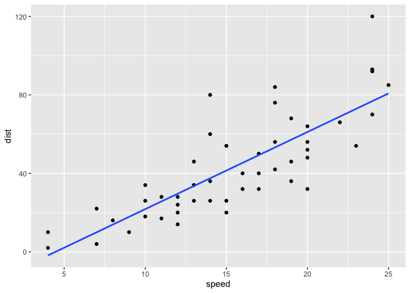

Data 5 - Visualization II
================
Simon Willemin
24 août 2022

-   [Description of the data](#description-of-the-data)
-   [Correlation ?](#correlation-)

``` r
library(readr)
library(dslabs)
library(tidyverse)
library(knitr)
library(ggplot2)
```

``` r
str(cars)
```

    ## 'data.frame':    50 obs. of  2 variables:
    ##  $ speed: num  4 4 7 7 8 9 10 10 10 11 ...
    ##  $ dist : num  2 10 4 22 16 10 18 26 34 17 ...

``` r
summary(cars)
```

    ##      speed           dist       
    ##  Min.   : 4.0   Min.   :  2.00  
    ##  1st Qu.:12.0   1st Qu.: 26.00  
    ##  Median :15.0   Median : 36.00  
    ##  Mean   :15.4   Mean   : 42.98  
    ##  3rd Qu.:19.0   3rd Qu.: 56.00  
    ##  Max.   :25.0   Max.   :120.00

``` r
print(cars)
```

    ##    speed dist
    ## 1      4    2
    ## 2      4   10
    ## 3      7    4
    ## 4      7   22
    ## 5      8   16
    ## 6      9   10
    ## 7     10   18
    ## 8     10   26
    ## 9     10   34
    ## 10    11   17
    ## 11    11   28
    ## 12    12   14
    ## 13    12   20
    ## 14    12   24
    ## 15    12   28
    ## 16    13   26
    ## 17    13   34
    ## 18    13   34
    ## 19    13   46
    ## 20    14   26
    ## 21    14   36
    ## 22    14   60
    ## 23    14   80
    ## 24    15   20
    ## 25    15   26
    ## 26    15   54
    ## 27    16   32
    ## 28    16   40
    ## 29    17   32
    ## 30    17   40
    ## 31    17   50
    ## 32    18   42
    ## 33    18   56
    ## 34    18   76
    ## 35    18   84
    ## 36    19   36
    ## 37    19   46
    ## 38    19   68
    ## 39    20   32
    ## 40    20   48
    ## 41    20   52
    ## 42    20   56
    ## 43    20   64
    ## 44    22   66
    ## 45    23   54
    ## 46    24   70
    ## 47    24   92
    ## 48    24   93
    ## 49    24  120
    ## 50    25   85

## Description of the data

We will take a look at the `cars` data, which is a pretty
straightforward two discrete numerical variables dataset. One describes
the speed at the “braking point” and the other the distance necessary to
stop the car.

## Correlation ?

We will test if an increase of the speed of the car results in an
increase of the necessary distance to stop it.

``` r
ggplot(cars, aes(speed, dist))+
  geom_point()+
  geom_smooth(method = "lm", se = FALSE)
```

    ## `geom_smooth()` using formula 'y ~ x'

<!-- -->

As expected (obviously) when can contemplate a strong correlation
between to the two.

Now, regarding the outliers ; there is always some kind of variability
when testing multiple setups. It could be that the weather conditions
were different, hence strongly impacting the braking distance, or the
tires (or their wearing state) might’ve been different. However, there
is still an overall correlation as you can see on the plot.
