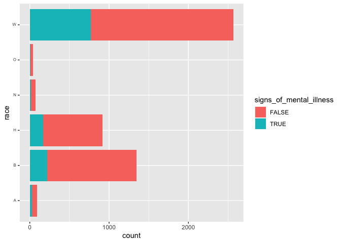

Data Modeling - Data 6
================
Simon Willemin
31 août 2022

-   [Police Shootings](#police-shootings)
    -   [Where does it comes from ?](#where-does-it-comes-from-)
-   [Plotting Signs of mental illness vs
    Race](#plotting-signs-of-mental-illness-vs-race)
    -   [Hypothesis formulation](#hypothesis-formulation)
    -   [Statistical test](#statistical-test)
-   [Reference](#reference)

``` r
library(readr)
library(dslabs)
library(tidyverse)
library(knitr)
library(ggplot2)
```

``` r
shootings <- read_csv('fatal-police-shootings-data.csv')
```

    ## Rows: 7568 Columns: 17
    ## ── Column specification ────────────────────────────────────────────────────────
    ## Delimiter: ","
    ## chr  (9): name, manner_of_death, armed, gender, race, city, state, threat_le...
    ## dbl  (4): id, age, longitude, latitude
    ## lgl  (3): signs_of_mental_illness, body_camera, is_geocoding_exact
    ## date (1): date
    ## 
    ## ℹ Use `spec()` to retrieve the full column specification for this data.
    ## ℹ Specify the column types or set `show_col_types = FALSE` to quiet this message.

``` r
str(shootings)
```

    ## spec_tbl_df [7,568 × 17] (S3: spec_tbl_df/tbl_df/tbl/data.frame)
    ##  $ id                     : num [1:7568] 3 4 5 8 9 11 13 15 16 17 ...
    ##  $ name                   : chr [1:7568] "Tim Elliot" "Lewis Lee Lembke" "John Paul Quintero" "Matthew Hoffman" ...
    ##  $ date                   : Date[1:7568], format: "2015-01-02" "2015-01-02" ...
    ##  $ manner_of_death        : chr [1:7568] "shot" "shot" "shot and Tasered" "shot" ...
    ##  $ armed                  : chr [1:7568] "gun" "gun" "unarmed" "toy weapon" ...
    ##  $ age                    : num [1:7568] 53 47 23 32 39 18 22 35 34 47 ...
    ##  $ gender                 : chr [1:7568] "M" "M" "M" "M" ...
    ##  $ race                   : chr [1:7568] "A" "W" "H" "W" ...
    ##  $ city                   : chr [1:7568] "Shelton" "Aloha" "Wichita" "San Francisco" ...
    ##  $ state                  : chr [1:7568] "WA" "OR" "KS" "CA" ...
    ##  $ signs_of_mental_illness: logi [1:7568] TRUE FALSE FALSE TRUE FALSE FALSE ...
    ##  $ threat_level           : chr [1:7568] "attack" "attack" "other" "attack" ...
    ##  $ flee                   : chr [1:7568] "Not fleeing" "Not fleeing" "Not fleeing" "Not fleeing" ...
    ##  $ body_camera            : logi [1:7568] FALSE FALSE FALSE FALSE FALSE FALSE ...
    ##  $ longitude              : num [1:7568] -123.1 -122.9 -97.3 -122.4 -104.7 ...
    ##  $ latitude               : num [1:7568] 47.2 45.5 37.7 37.8 40.4 ...
    ##  $ is_geocoding_exact     : logi [1:7568] TRUE TRUE TRUE TRUE TRUE TRUE ...
    ##  - attr(*, "spec")=
    ##   .. cols(
    ##   ..   id = col_double(),
    ##   ..   name = col_character(),
    ##   ..   date = col_date(format = ""),
    ##   ..   manner_of_death = col_character(),
    ##   ..   armed = col_character(),
    ##   ..   age = col_double(),
    ##   ..   gender = col_character(),
    ##   ..   race = col_character(),
    ##   ..   city = col_character(),
    ##   ..   state = col_character(),
    ##   ..   signs_of_mental_illness = col_logical(),
    ##   ..   threat_level = col_character(),
    ##   ..   flee = col_character(),
    ##   ..   body_camera = col_logical(),
    ##   ..   longitude = col_double(),
    ##   ..   latitude = col_double(),
    ##   ..   is_geocoding_exact = col_logical()
    ##   .. )
    ##  - attr(*, "problems")=<externalptr>

``` r
head(shootings) %>% kable()
```

|  id | name               | date       | manner_of_death  | armed      | age | gender | race | city          | state | signs_of_mental_illness | threat_level | flee        | body_camera | longitude | latitude | is_geocoding_exact |
|----:|:-------------------|:-----------|:-----------------|:-----------|----:|:-------|:-----|:--------------|:------|:------------------------|:-------------|:------------|:------------|----------:|---------:|:-------------------|
|   3 | Tim Elliot         | 2015-01-02 | shot             | gun        |  53 | M      | A    | Shelton       | WA    | TRUE                    | attack       | Not fleeing | FALSE       |  -123.122 |   47.247 | TRUE               |
|   4 | Lewis Lee Lembke   | 2015-01-02 | shot             | gun        |  47 | M      | W    | Aloha         | OR    | FALSE                   | attack       | Not fleeing | FALSE       |  -122.892 |   45.487 | TRUE               |
|   5 | John Paul Quintero | 2015-01-03 | shot and Tasered | unarmed    |  23 | M      | H    | Wichita       | KS    | FALSE                   | other        | Not fleeing | FALSE       |   -97.281 |   37.695 | TRUE               |
|   8 | Matthew Hoffman    | 2015-01-04 | shot             | toy weapon |  32 | M      | W    | San Francisco | CA    | TRUE                    | attack       | Not fleeing | FALSE       |  -122.422 |   37.763 | TRUE               |
|   9 | Michael Rodriguez  | 2015-01-04 | shot             | nail gun   |  39 | M      | H    | Evans         | CO    | FALSE                   | attack       | Not fleeing | FALSE       |  -104.692 |   40.384 | TRUE               |
|  11 | Kenneth Joe Brown  | 2015-01-04 | shot             | gun        |  18 | M      | W    | Guthrie       | OK    | FALSE                   | attack       | Not fleeing | FALSE       |   -97.423 |   35.877 | TRUE               |

``` r
shootings <- na.omit(shootings)
shootings 
```

    ## # A tibble: 5,035 × 17
    ##       id name    date       manne…¹ armed   age gender race  city  state signs…²
    ##    <dbl> <chr>   <date>     <chr>   <chr> <dbl> <chr>  <chr> <chr> <chr> <lgl>  
    ##  1     3 Tim El… 2015-01-02 shot    gun      53 M      A     Shel… WA    TRUE   
    ##  2     4 Lewis … 2015-01-02 shot    gun      47 M      W     Aloha OR    FALSE  
    ##  3     5 John P… 2015-01-03 shot a… unar…    23 M      H     Wich… KS    FALSE  
    ##  4     8 Matthe… 2015-01-04 shot    toy …    32 M      W     San … CA    TRUE   
    ##  5     9 Michae… 2015-01-04 shot    nail…    39 M      H     Evans CO    FALSE  
    ##  6    11 Kennet… 2015-01-04 shot    gun      18 M      W     Guth… OK    FALSE  
    ##  7    13 Kennet… 2015-01-05 shot    gun      22 M      H     Chan… AZ    FALSE  
    ##  8    15 Brock … 2015-01-06 shot    gun      35 M      W     Assa… KS    FALSE  
    ##  9    16 Autumn… 2015-01-06 shot    unar…    34 F      W     Burl… IA    FALSE  
    ## 10    17 Leslie… 2015-01-06 shot    toy …    47 M      B     Knox… PA    FALSE  
    ## # … with 5,025 more rows, 6 more variables: threat_level <chr>, flee <chr>,
    ## #   body_camera <lgl>, longitude <dbl>, latitude <dbl>,
    ## #   is_geocoding_exact <lgl>, and abbreviated variable names ¹​manner_of_death,
    ## #   ²​signs_of_mental_illness

# Police Shootings

## Where does it comes from ?

I’ve found this data on Github and it originates from the Washington
Post. It is about the police shootings by officers on duty since 2015.
It has lots of information about the circumstances of the shootings, for
instance it displays the threat level of the “victim” into character
variables. This data is really useful because it actually helps to have
reliable data when talking about such sensitive topics.

# Plotting Signs of mental illness vs Race

We will plot here two variables using `ggplot`, namely to see the
reported signs of mental illness by different races.

``` r
ggplot(shootings, aes(y=race))+
  geom_bar(aes(fill=signs_of_mental_illness))+  
  theme(axis.text.y = element_text(angle = 360, vjust = 0.3, hjust=1,size=6))
```

<!-- -->

## Hypothesis formulation

H1: Race has an impact on the reported Signs of mental illness H0: Signs
of mental illness are not influenced by race

## Statistical test

We will do a chi-square test, since those variables are likely
non-parametric. (I’m however not familiar with such notions and tests
and am hence wildly speculating here)

``` r
chisq.test(table(shootings$race,shootings$signs_of_mental_illness))
```

    ## 
    ##  Pearson's Chi-squared test
    ## 
    ## data:  table(shootings$race, shootings$signs_of_mental_illness)
    ## X-squared = 111.69, df = 5, p-value < 2.2e-16

We can reject H0, since the correlation seems quite strong (p-value \<
2.2e-16)

# Reference

<https://github.com/washingtonpost/data-police-shootings.git>
